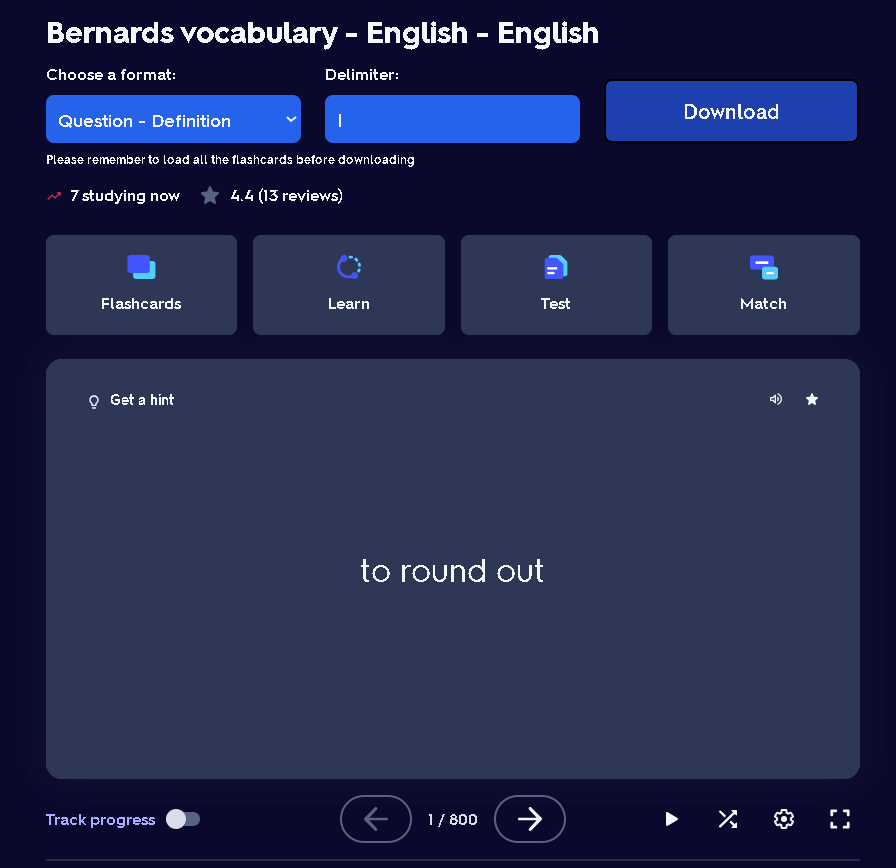
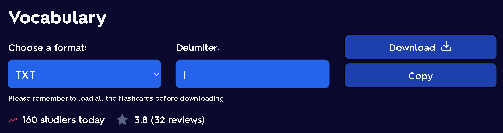
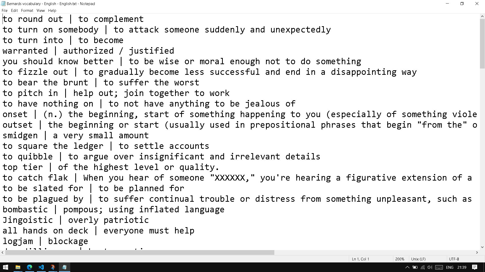

# Quizlet Getter

- Simple chrome extension for getting flashcards from Quizlet

## Installation

- Download repository
- Unzip the packed file
- Go to chrome extension manager
- Turn on "Developer mode"
- Click "Load unpacked" button
- Choose "dist" folder in the extracted folder

## How to use

- Go to your Quizlet
- Load all the question in your page
- Scroll to the top of website
- Choose the format
- Choose the delimiter
- Click "Download"

## Result example

