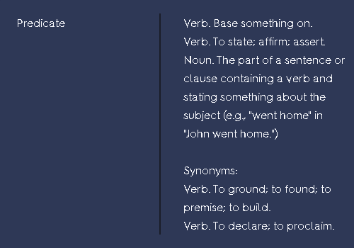
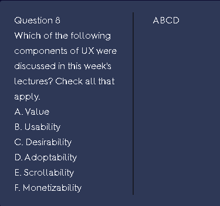

# Quizlet Getter

- Simple chrome extension for getting flashcards from Quizlet

## Demo

## Installation

- Download repository
- Unzip the packed file
- Go to chrome extension manager
- Turn on "Developer mode"
- Click "Load unpacked" button
- Choose "dist" folder in the extracted folder

## How to use

- Go to your Quizlet
- Load all the question in your page
- Scroll to the top of website
- Choose the format of your flashcards
- Click "Get all Flashcards"

## Supporting Formats

### Question Definition Format

Example:

### Definition Question Format

Like Question Definition Format but opposite

### Coursera Key Format

- A multichoices question
- Question in the left box
- Answers belong with question in the left box
- Answers follow the format: a. Answer 1, b. Answer 2, ...
- Keys in the right box
- Keys doesn't contain any definitions, only have the keys character
