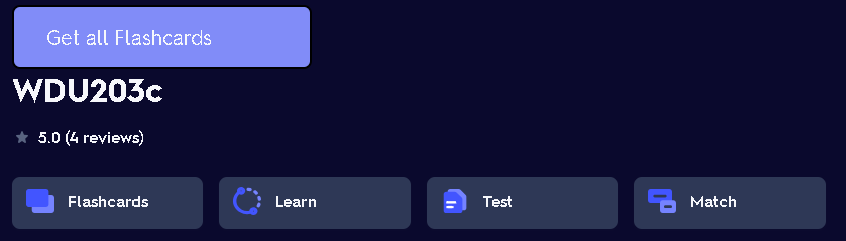
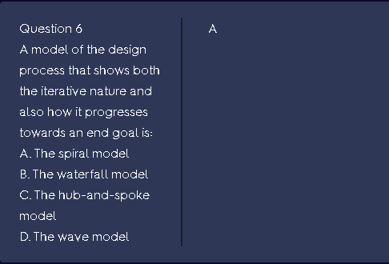
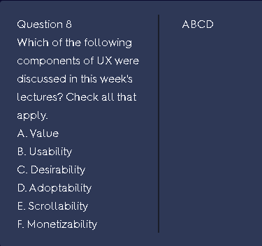

# Quizlet Getter

- Simple chrome extension for getting flashcards from Quizlet

## Demo

## Installation

- Download repository
- Unzip the packed file
- Go to chrome extension manager
- Turn on "Developer mode"
- Click "Load unpacked" button
- Choose "dist" folder in the extracted folder

## How to use

- Go to your Quizlet
- Load all the question in your page
- Scroll to the top of website and click "Get all Flashcards"

## Caution

### Only work if your target page have the question format like below:

- Must be a multichoices question
- Question in the left box
- Answers belong with question in the left box
- Answers follow the format: a. Answer 1, b. Answer 2, ...
- Keys in the right box

### Examples

