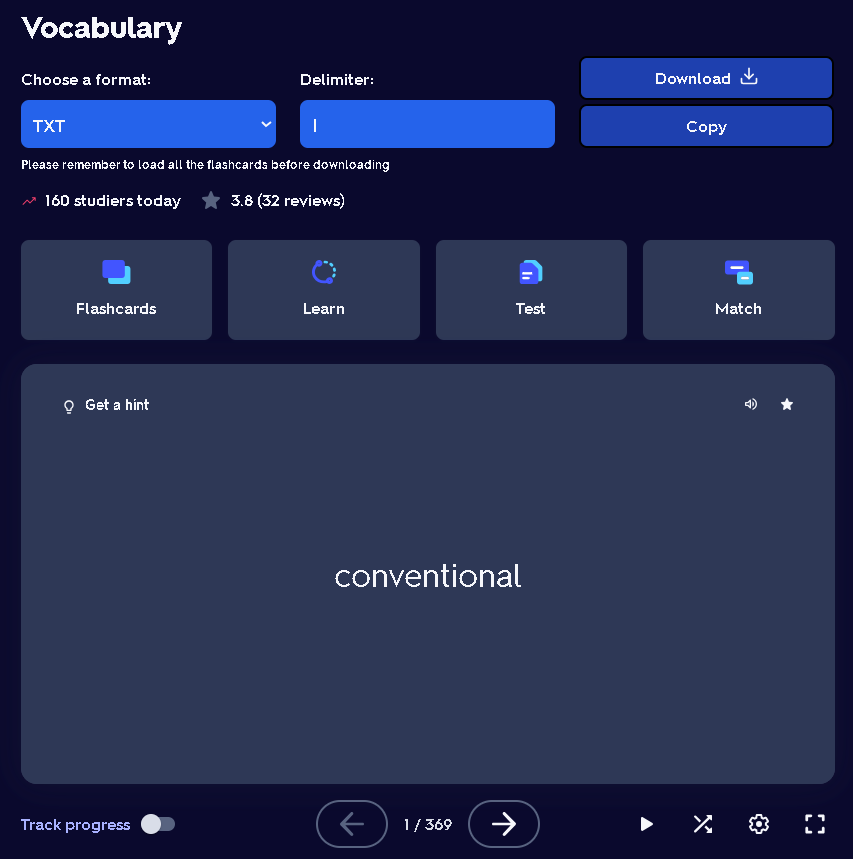

# Quizlet Getter

- Simple chrome extension for getting flashcards from Quizlet

## Install

https://chromewebstore.google.com/detail/get-quizlet-flashcards/oaaodhahcdoonllnnhamgkcidjicjcad

## How to use

- Go to your Quizlet
- Load all the question in your page
- Scroll to the top of website
- Choose the format
- Choose the delimiter (optional)
- Click "Download" or "Copy" it

## Result example

## Supported formats

- TXT
- JSON
- XML
- YAML
- Markdown
- HTML
- CSV (not recommended)
